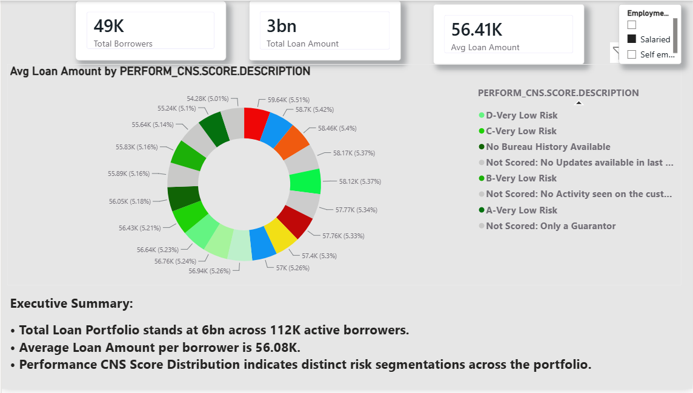

# Vehicle Loan Analytics & AI-Driven Insights Dashboard

An end-to-end Data Analytics project integrated with AI/LLM technologies to deliver interactive business insights and automated data storytelling for vehicle loan portfolio management.

## 📌 Project Overview
โปรเจกต์นี้สร้างขึ้นเพื่อวิเคราะห์ข้อมูล**สินเชื่อยานพาหนะ (Vehicle Loan Dataset)** เพื่อช่วยให้ผู้บริหารสามารถมองเห็นภาพรวมความเสี่ยง การอนุมัติสินเชื่อ และแนวโน้มธุรกิจแบบ **End-to-End Visibility** โดยดึงพลังของ **Power BI (Advanced BI)** ร่วมกับ **AI & LLM (Prompt Engineering)** ในการวิเคราะห์และสร้าง **Data Storytelling** ที่ทรงพลังในการตัดสินใจ

---

## 🛠️ Tech Stack & Tools
* **Data Preparation & Cleaning:** Python (Pandas)
* **Database & Extraction:** SQL
* **Data Transformation & Modeling:** Power Query (M Code), Advanced DAX
* **Data Visualization:** Power BI Desktop
* **AI & Automation:** Python, LLM API / Prompt Engineering

---

## 🚀 Key Features & Implementation

### 1. Data Cleaning & Preparation (Python)
Python script for cleaning and preparing vehicle loan dataset, handling missing values, formatting dates, and removing duplicates.

### 2. Data Preparation & Power Query (M Code)
* นำข้อมูลสินเชื่อรถยนต์ที่ผ่านการคลีนจาก Python เข้าสู่ Power BI ดำเนินการตรวจสอบความถูกต้องของประเภทข้อมูล (Data Types)
* ใช้ Power Query ในการจัดหมวดหมู่ข้อมูลและเตรียมคอลัมน์ให้พร้อมสำหรับการทำรายงาน

### 3. Data Modeling & Analytics (DAX)
* เชื่อมโยงความสัมพันธ์ของข้อมูล (Data Modeling) เพื่อให้ระบบรายงานทำงานได้อย่างมีประสิทธิภาพ
* เขียนสูตร DAX พื้นฐานที่จำเป็นต่อธุรกิจ เช่น การคำนวณยอดรวมวงเงินสินเชื่อ, จำนวนผู้กู้ทั้งหมด และสัดส่วนผู้กู้ในแต่ละกลุ่ม

### 4. AI-Assisted Analytics & Data Storytelling
* ใช้ฟีเจอร์ AI สำเร็จรูปใน Power BI เช่น **Smart Narrative** ในการช่วยสรุปข้อมูลเชิงลึกและอธิบายข้อค้นพบสำคัญให้ออกมาเป็นตัวหนังสือโดยอัตโนมัติ
* ใช้ AI (เช่น ChatGPT) เป็นผู้ช่วยในการไกด์ไอเดียการออกแบบตัววัดผลและการวางหน้ารายงานให้ตอบโจทย์ผู้บริหาร

## 📊 Dashboard Preview

## 💡 Key Business Insights
* **Insight 1:** แสดงภาพรวมและสัดส่วนของผู้กู้เงินซื้อรถยนต์แยกตามประเภทและภูมิภาค เพื่อให้เห็นกลุ่มลูกค้าหลัก
* **Insight 2:** สรุปปัจจัยเบื้องต้นที่มีผลต่อวงเงินสินเชื่อ เพื่อช่วยให้ผู้บริหารมองเห็นแนวโน้มการเติบโตของพอร์ตสินเชื่อในภาพรวม
